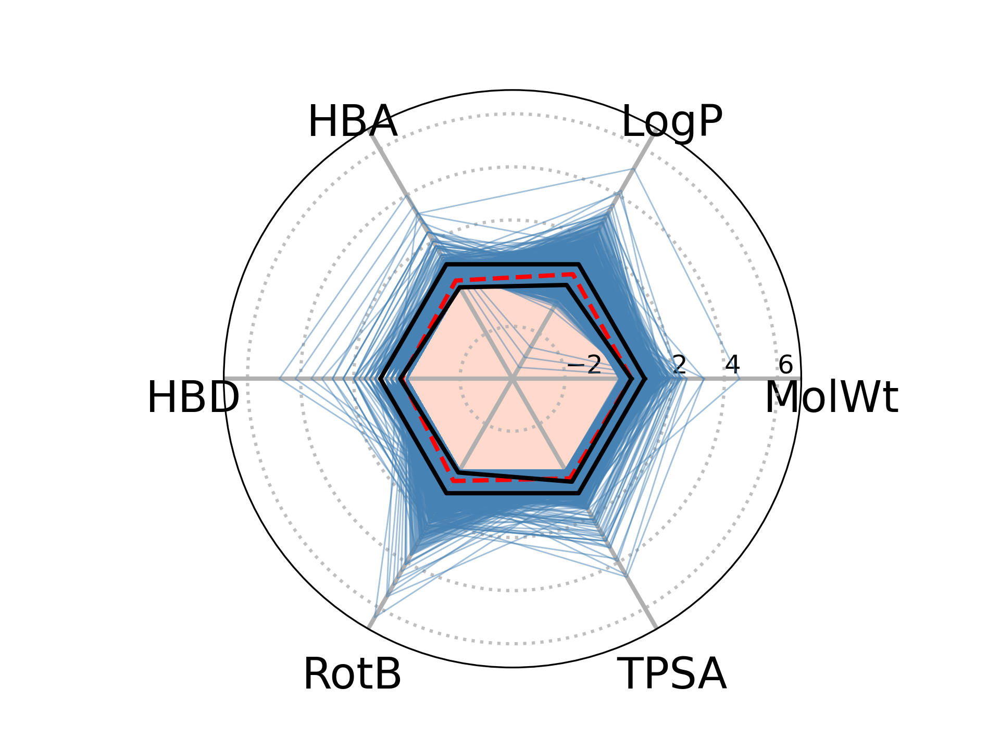

# Chembee
Data processing for chemistry and drug design

# Visuals 
Get to know your data with especially polar charts. 

# References 

1. Ruiz-Moreno, A. J., Reyes-Romero, A., Dömling, A., & Velasco-Velázquez, M. A. (2021). In silico design and selection of new tetrahydroisoquinoline-based CD44 antagonist candidates. Molecules (Basel, Switzerland), 26(7), 1877.